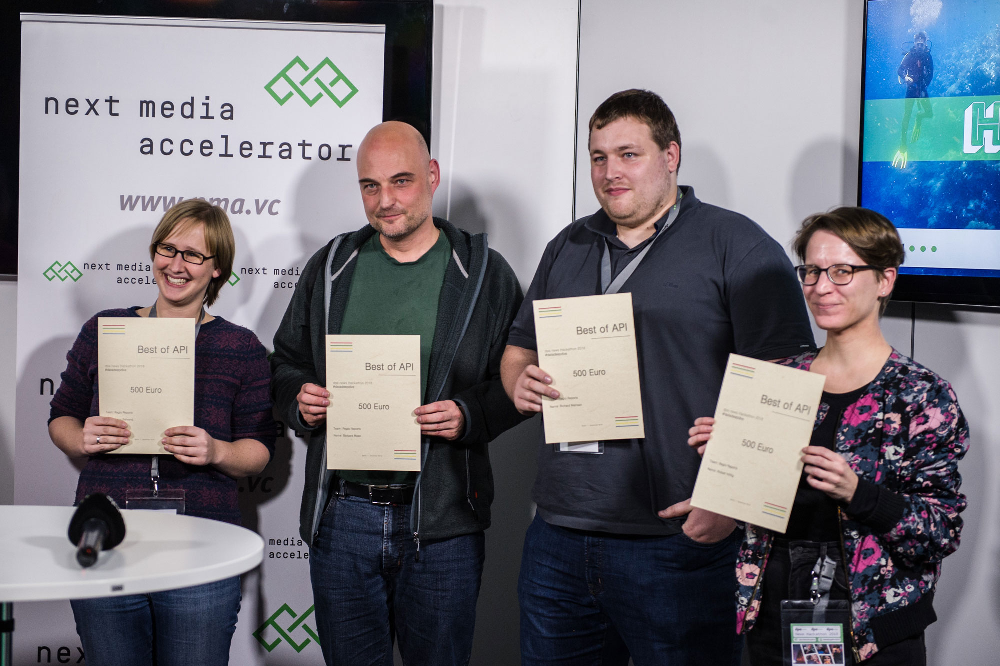

Das Projekt _Regio Reports_ ist beim [#DataDeepDive-Hackathon](https://www.dpa.com/de/unternehmen/dpa-zeichnet-aus/picturepunk/#data-deep-dive) der dpa ausgezeichnet worden. Ziel von Regio Reports ist es, mehr datengetriebenen Journalismus in Lokal- und Regionalredaktionen zu bringen. Dafür nutzt es die Datenschnittstelle von Datenguide.

<small>Das Team _Regio Reports_: Anna Behrend, Robert Höfig, Richard Meinsen und Barbara Maas. (Foto: obs/dpa Deutsche Presse-Agentur GmbH/Wolfram Kastl).</small>

---

Warum ist der Anteil ausländischer Gäste im Landkreis Grafschaft Bentheim viel höher als überall sonst in Niedersachsen? Warum besuchen in Kiel fast zehnmal so viele Kinder eine Ganztagskita wie im Kreis Dithmarschen?

Hinter solchen Fragen können sich interessante Geschichten verbergen. Diese Geschichten stecken jedoch in den Datensätzen der amtlichen Statistik, die für die meisten Redakteure in Lokal- und Regionalredaktionen schwer zugänglich sind. Häufig mangelt es an…

- Zeit, um auf die Suche nach interessanten Daten zu gehen.
- technischem Knowhow, um die Daten aufzubereiten, zu analysieren und zu visualisieren.
- statistischem Wissen, um zu beurteilen, wann in den Daten interessante Auffälligkeiten stecken.

Die Aussage eines Regionalredakteurs des Schleswig-Holsteinischen Zeitungsverlags bringt das Problem auf den Punkt:

> „Ich weiß gar nicht, wo ich suchen soll, was es gibt und was ich damit weiter machen soll. Und ich habe keine Zeit, mich darum zu kümmern.“

Hier setzt die im Projekt _Regio Reports_ entwickelte Software an. Sie analysiert Daten der amtlichen Statistik und erstellt automatische einen Bericht, wenn die Daten in einer Region besonders auffällig sind. Neben einer automatisch erstellten Erläuterung zu den Auffälligkeiten, enthält der Bericht auch Visualisierungen, die direkt im Artikel genutzt werden können. Die Redakteurinnen und Redakteure in der entsprechenden Region erhalten den Bericht über ihre Region zum Beispiel als PDF-Datei per Mail – als Ausgangspunkt für eine weitere Recherche vor Ort.

Im Rahmen des #DataDeepDive-Hackathons haben Journalistinnen von NOZ und mh:n Medien (Barbara Maas und Anna Behrend) gemeinsam mit Programmierern (Robert Höfig und Richard Meinsen) einen Prototypen für ein solches Tool entwickelt. Die Daten der amtlichen Statistik werden dabei über die [Datenguide-API](https://github.com/datenguide/datenguide/blob/master/docs/_api-docs/api_docs.md) geladen.

[Mehr über den Hackathon und die Preisträger-Projekte](https://www.presseportal.de/pm/8218/4131855)
